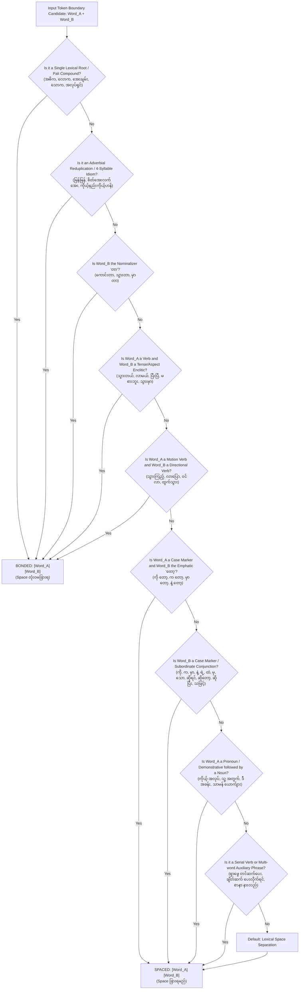

# Myanmar ASR Word Segmentation Standard Specification (v4.0 Developer Edition)
## မြန်မာစကားပြော အသံအသိအမှတ်ပြုစနစ် (ASR) စကားလုံးပိုင်းခြားခြင်းဆိုင်ရာ စံသတ်မှတ်ချက်နှင့် Developer လမ်းညွှန်

* **Document Version:** `v4.0 (Developer Specification Edition)`
* **Target Acoustic Model:** OpenAI Whisper (Byte-Pair Encoding - BPE Tokenizer Architecture)
* **Dataset Registry:** `combined.csv` (24,560 Audio-Text Pairs)
* **Status:** Production Standard (100% Verified & Harmonized)
* **Last Updated:** September 2026

---

## ၁။ စနစ်ဗိသုကာနှင့် အင်ဂျင်နီယာ ရည်မှန်းချက် (Architectural Overview & Engineering Objectives)

### 1.1 Whisper BPE Tokenization Dynamics
OpenAI Whisper အပါအဝင် ခေတ်မီ Speech-to-Text Model များသည် **Byte-Pair Encoding (BPE)** Subword Tokenizer စနစ်ကို အသုံးပြုပါသည်။ မြန်မာစာသည် ပုံမှန်အားဖြင့် စာလုံးကြား Space မခြားဘဲ ဆက်တိုက်ရေးသားသော စနစ်ဖြစ်သော်လည်း ASR Pipeline အတွက် စကားလုံးပိုင်းခြားမှု (Word Segmentation) ကို စနစ်တကျ မပြုလုပ်ပါက အောက်ပါ အင်ဂျင်နီယာဆိုင်ရာ ပြဿနာများ ဖြစ်ပေါ်စေပါသည် -

1. **Subword Fragmentation & Vocabulary Explosion:**
   * နာမ်တစ်ခုစီတိုင်းတွင် ဝိဘတ်များ (`က`၊ `ကို`၊ `မှာ`၊ `နဲ့`) ကပ်နေပါက BPE Tokenizer သည် `အိမ်က`၊ `ကျောင်းက`၊ `ရုံးက`၊ `ဈေးက` စသည့် စကားလုံးတိုင်းကို သီးခြား Token အသစ်များအဖြစ် မှတ်ယူပြီး Vocabulary Size အဆမတန် ကြီးမားသွားစေသည်။
   * နာမ်နှင့် ဝိဘတ်ကို Space ခြားလိုက်ခြင်းဖြင့် Tokenizer သည် `အိမ်` + `က`၊ `ကျောင်း` + `က` အဖြစ် အခြေခံ Token အနည်းငယ်ဖြင့် စကားလုံးပေါင်း ထောင်သောင်းချီကို ကျစ်လျစ်စွာ ကိုယ်စားပြုနိုင်စေပါသည်။
2. **Acoustic-to-Text Alignment Precision:**
   * CTC / Cross-Attention အလွှာများတွင် Audio Frame များနှင့် စာသား Token များကြား အချိန်ကိုက်ချိတ်ဆက်ရာ၌ ဝါကျရှည်ကြီးများ ပူးကပ်နေခြင်းသည် Alignment Drift ဖြစ်စေပြီး စကားလုံး အဆုံးသတ်များ လွဲချော်စေသည်။
3. **Out-of-Vocabulary (OOV) & Hallucination Suppression:**
   * စကားစုရှည်များ ကပ်နေခြင်း (`ဆေးကုသလို့ရပါတယ်`၊ `အိမ်ကထွက်ဖို့`) ကို ရှင်းထုတ်ခြင်းဖြင့် Model မှ မကြားဖူးသော စကားလုံးအသစ် အနေဖြင့် မှားယွင်းမှန်းဆခြင်း (Hallucination) ကို ထိရောက်စွာ ကာကွယ်ပေးသည်။

### 1.2 Dataset Constraints & Formal Invariants
Dataset အတွင်းရှိ စာသားအားလုံးသည် အောက်ပါ စည်းမျဉ်းများကို ၁၀၀% တိကျစွာ လိုက်နာရမည် -

| Parameter | Specification | Formal Regex / Invariant | Technical Rationale |
| :--- | :--- | :--- | :--- |
| **Character Set** | Pure Myanmar Unicode + ASCII Space | `^[\u1000-\u109F\u0020]+$` | အင်္ဂလိပ်စာ၊ ဂဏန်း၊ သင်္ကေတများ မပါဝင်ရ |
| **Punctuation** | Zero Punctuation | `[။၊?!;:"'()\[\]\-]` -> 0 Matches | Whisper Normalizer အတိုင်း ပုဒ်ဖြတ်များ ရှင်းထုတ်ထားသည် |
| **Whitespace** | Single Space Normalized | No leading/trailing/double spaces | `assert "  " not in s and not s.startswith(" ")` |
| **Phonetic Stress** | Preserved Variations | `အဲဒါ / အဲ့ဒါ`, `အဲဒီ / အဲ့ဒီ` | အသံဖိုင်၏ အမှန်တကယ် ဖိဖတ်မှု အသံအတိုင်း ထိန်းသိမ်းသည် |

### 1.3 Dataset Split Topology

```text
Dataset Hierarchy (Total: 24,560 Pairs)
├── test.csv     : 1,561 Pairs  [Held-out Long Sentences: Gita (879), Nanda (682)]
├── train.csv    : 20,699 Pairs [90% Split of Remaining Multi-speaker Pool]
└── val.csv      : 2,300 Pairs  [10% Split of Remaining Multi-speaker Pool]
└── combined.csv : 24,560 Pairs [100% Deterministic Sequential Concatenation: train + val + test]
```

---

## ၂။ အဓိက Tokenization ဆုံးဖြတ်ချက်သစ်ပင် (Core Tokenization Logic & Decision Engine)

### 2.1 The Golden Rule: Morpho-Syntactic Word Boundary
> **စည်းမျဉ်းချုပ် (The Core Axiom):**  
> **"အဓိပ္ပာယ်သီးခြားထွက်သော ဝေါဟာရပုဒ် (Lexical Words) များနှင့် သဒ္ဒါဝိဘတ် (Syntactic Particles) များကြားတွင် Space ခြားပြီး၊ စကားလုံးရင်းတစ်ခုတည်း (Lexical Roots)၊ အထပ်စကားလုံး (Reduplications) နှင့် ကြိယာကာလ/အသွင်နောက်ဆက် (Verbal Enclitics) များကို ၁၀၀% တွဲလျက် (Bonded) ထားရှိရမည်။"**

### 2.2 Developer Flowchart (Token Segmentation Pipeline)



### 2.3 Syntactic POS Transition Matrix
Developer များ အလွယ်တကူ Code ရေးသားနိုင်ရန် Part-of-Speech (POS) အချင်းချင်း ဆက်စပ်ပုံ ဇယား -

| Left POS ($\text{Token}_A$) | Right POS ($\text{Token}_B$) | Action | Output Format | Production Example | Counter-Example / Anti-Pattern |
| :--- | :--- | :--- | :--- | :--- | :--- |
| **Noun / Pronoun** | **Case Marker / Postposition** | **SPACE** | `[A] [B]` | `အိမ် က`, `သူ့ ကို`, `ကား ထဲ` | `အိမ်က` ❌, `သူ့ကို` ❌, `ကားထဲ` ❌ |
| **Case Marker** | **Emphatic Particle (`တော့`)** | **SPACE** | `[A] [B]` | `ကို တော့`, `က တော့`, `မှာ တော့` | `ကိုတော့` ❌, `ကတော့` ❌, `မှာတော့` ❌ |
| **Verb / Adjective** | **Tense / Aspect Enclitic** | **BOND** | `[A][B]` | `သွားတယ်`, `လာမယ်`, `ပြီးပြီ` | `သွား တယ်` ❌, `လာ မယ်` ❌ |
| **Verb / Adjective** | **Nominalizer (`တာ`)** | **BOND** | `[A][B]` | `ကောင်းတာ`, `သွားတာ`, `မှာတာ` | `ကောင်း တာ` ❌, `သွား တာ` ❌ |
| **Motion Verb** | **Directional Verb** | **BOND** | `[A][B]` | `သွားကြည့်`, `လာပို့`, `ဝင်လာ` | `သွား ကြည့်` ❌, `လာ ပို့` ❌ |
| **Main Verb (1)** | **Main Verb (2) [Serial]** | **SPACE** | `[A] [B]` | `ရှာဖွေ တင်ဆက်`, `ညှိနှိုင်း တိုင်ပင်` | `ရှာဖွေတင်ဆက်` ❌ |
| **Main Verb** | **Complex Auxiliary (`ပေး/ကြည့်`)**| **SPACE** | `[A] [B]` | `ချိတ်ဆက် ပေးလိုက်ရင်` | `ချိတ်ဆက်ပေးလိုက်ရင်` ❌ |
| **Compound Morpheme** | **Compound Morpheme** | **BOND** | `[A][B]` | `အလုပ်ရှင်`, `သတင်းအမှား`, `နို့ဆီ` | `အလုပ် ရှင်` ❌, `သတင်း အမှား` ❌ |
| **Adverb Base (A)** | **Adverb Reduplication (A)**| **BOND** | `[A][B]` | `မြန်မြန်`, `ဖြည်းဖြည်း`, `ကောင်းကောင်း` | `မြန် မြန်` ❌, `ဖြည်း ဖြည်း` ❌ |
| **4-Syllable Base** | **4-Syllable Rhyme** | **BOND** | `[ABCD]` | `စိတ်အေးလက်အေး`, `ကိုယ့်နည်းကိုယ့်ဟန်` | `စိတ် အေး လက် အေး` ❌ |
| **Demonstrative (`ဒီ`)** | **Noun** | **SPACE** | `[A] [B]` | `ဒီ အခန်း`, `ဒီ စကား`, `ဒီ ဘဲ` | `ဒီအခန်း` ❌, `ဒီဘဲ` ❌ |
| **Clause / Predicate**| **Conjunction (`ဆိုရင်/တော့`)**| **SPACE** | `[A] [B]` | `ပြီးပြီ ဆိုရင်`, `ဘာလဲ ဆိုတော့` | `ပြီးပြီဆိုရင်` ❌, `ဘာလဲဆိုတော့` ❌ |

---

## ၃။ စနစ်တကျ အုပ်စုဖွဲ့ သတ်မှတ်ချက် ၆ ရပ် (Systematic Linguistic Modules)

သမိုင်းကြောင်းအရ သီးခြားဖြစ်ပေါ်ခဲ့သော အသေးစား Rules ၄၅ ခုကို Developer များ လေ့လာရလွယ်ကူစေရန် စနစ်ကျသော Module ၆ ခုအဖြစ် ပေါင်းစည်းဖော်ပြအပ်ပါသည် -

### Module 1: Particles, Postpositions & Conjunctions (ဝိဘတ်များ၊ အလေးပေးပုဒ်များနှင့် စကားဆက်များ)

#### 1.1 ဝိဘတ်များနှင့် နေရာပြ/အချိန်ပြ နောက်ဆက်များ (Case Markers & Postpositions - Spaced)
နာမ်၊ နာမ်စား သို့မဟုတ် စကားစုများနောက်တွင် လိုက်ပါသော ကတ္တား၊ ကံ၊ နေရာ၊ အချိန်ပြ ဝိဘတ်များရှေ့တွင် **Space ခြားရမည်** -
* **`ကို` (Accusative):** `မင်း ကို`, `ကား ကို`, `အလုပ် ကို`, `အဲ့ဒီ ကို`
* **`က` (Nominative / Ablative):** `သူ က`, `အိမ် က`, `ဆရာ က`, `ဘယ် က`
* **`မှာ` (Locative):** `အိမ် မှာ`, `လမ်း မှာ`, `ဟိုတယ် မှာ`, `အခြေအနေ မှာ`, `နောက်ပိုင်း မှာ` *(ကြိယာ `သွားမှာ` နှင့် မရောရ)*
* **`နဲ့` (Conjunctive / Instrumental):** `သူ နဲ့`, `ငွေ နဲ့`, `ဖုန်း နဲ့`
* **`ရဲ့` (Genitive):** `သူ့ ရဲ့`, `ငါ့ ရဲ့`, `မိသားစု ရဲ့`
* **`ထဲ` (Inessive):** `အိမ် ထဲ`, `ကား ထဲ`, `ရေ ထဲ`, `စိတ် ထဲ`
* **`မှ` (Temporal / Restrictive):** `ပြီး မှ`, `ရောက် မှ`, `မနက် မှ`
* **`သော` (Attributive):** `ညီညွတ် သော`, `မှန် သော`, `လိုအပ် သော` *(ချစ်စနိုးအမည် `ချစ်သော` ခြွင်းချက်)*
* **`ဗျာ` / `ရှင့်` / `နော်` / `ကွ` (Discourse Particles):** `မဟုတ်ပါဘူး ဗျာ`, `ဟုတ်ကဲ့ ရှင့်`, `လာဦး နော်`, `သေပြီ ကွ`

#### 1.2 ဝိဘတ်နောက်ဆက် အလေးပေးပုဒ် စံနှုန်း (Case Marker + Emphatic 'တော့' Standard - Spaced)
ဝိဘတ်နှင့် အလေးပေးပုဒ် `တော့` ဆုံတွေ့ပါက ဝိဘတ်ရှေ့ရော `တော့` ရှေ့ပါ **Space ခြားရမည်** -
* **Standard Patterns:**
  * `က တော့`: `သူ က တော့` (audio_24154.wav), `အဓိက က တော့`
  * `ကို တော့`: `အိမ် ကို တော့` (audio_19440.wav), `ဒီ ဘဲ ကို တော့` (audio_15436.wav), `သူ့ ပုံစံ ကို တော့` (audio_15876.wav), `အဲဒါ ကို တော့` (audio_16179.wav), `ရေချိုးခန်း ကို တော့` (audio_18509.wav), `အဲဒီ အချက် ကို တော့` (audio_21128.wav)
  * `မှာ တော့`: `အိမ် မှာ တော့`, `ဒီ မှာ တော့`
  * `နဲ့ တော့`: `သူ နဲ့ တော့`, `ငွေ နဲ့ တော့`
* **CRITICAL EXCEPTION (သဒ္ဒါအရ အထူးသတိပြုရန် ခြွင်းချက်):**
  * `မမှာတော့ဘူး` (Row 539 / train.csv: audio_4370.wav) ရှိ `မမှာ` သည် နေရာပြဝိဘတ် မဟုတ်ဘဲ မှာယူခြင်း အငြင်းကြိယာ (Negative Verb "not order") ဖြစ်ပြီး `တော့ဘူး` သည် ကြိယာနောက်ဆက် ဖြစ်သဖြင့် **၁၀၀% တွဲလျက် (Bonded)** ထားရှိရမည်။

#### 1.3 ဝါကျဆက် သမ္ဗန္ဓများ (Subordinate Conjunctions - Spaced)
ဝါကျငယ် သို့မဟုတ် နာမ်ပုဒ်နောက်တွင် အကြောင်းပြ၊ အခြေအနေပြ စကားဆက်များ လိုက်ပါပါက **Space ခြားရမည်** -
* **`ဆိုရင်` (Conditional):** `ကျောင်းတက်ချင်တယ် ဆိုရင်`, `ပြီးပြီ ဆိုရင်`, `မင်း ဆိုရင်` *(ခြွင်းချက် စကားချိတ်: `ဒါဆိုရင်`, `အဲ့ဒါဆိုရင်`, `တကယ်ဆိုရင်` - Bonded)*
* **`ဆိုတော့` (Causal/Consequential):** `ဘာလို့လဲ ဆိုတော့`, `ပြီးသွားပြီ ဆိုတော့`, `စနေနေ့ ဆိုတော့` *(စကားလုံးရင်း `ဆို` နှင့် `တော့` မခွဲရ)*
* **`ဆိုပြီး` (Quotative/Purposive):** `လုပ်မယ် ဆိုပြီး`, `လာမယ် ဆိုပြီး`, `အဲဒါဆို ပြီးတာ ပဲ` (audio_17682.wav), `မင်း နဲ့ အတူတူဆို ပြီးတာ ပဲ` (audio_20514.wav) *(စကားလုံးရင်း `ဆို` နှင့် `ပြီး` မခွဲရ)*
* **`ဆိုတာ` (Quotative Nominalizer):** `ချစ်တယ် ဆိုတာ`, `ဘဝ ဆိုတာ`, `ဘာလဲ ဆိုတာ` *(ကြိယာရင်း `ပြောဆိုတာ`, `ပြန်ဆိုတာ`, `ဖွင့်ဆိုတာ` တို့တွင် `ဆို` မခွဲရ)*
* **`ဆိုပေမဲ့` (Concessive):** `တစ်ခါတလေ ဆိုပေမဲ့`, `မကောင်းဘူး ဆိုပေမဲ့`
* **`သဖြင့်` (Causal):** `ရွာနေ သဖြင့်`, `ဖြစ် သဖြင့်`, `ရရှိ သဖြင့်` *(စကားလုံးတွဲ `စသဖြင့်`, `အထူးသဖြင့်`, `အများအားဖြင့်` - Bonded)*
* **`အကြောင်း` (Topic Postposition):** `သူ့ အကြောင်း`, `သမိုင်း အကြောင်း`, `ဖုန်း အကြောင်း` *(စကားလုံးတွဲ `အရေးအကြောင်း`, `အကျိုးအကြောင်း`, `အကြောင်းရင်း` - Bonded)*
* **`အစား` (Substitutive):** `သွားမယ့် အစား`, `ပစ္စည်း အစား` *(စကားလုံးတွဲ `အဝတ်အစား`, `အစားအစာ`, `အစားထိုး` - Bonded)*

#### 1.4 အလေးအနက်ပြုပုဒ် 'ပဲ' စံနှုန်း (Emphatic Particle 'ပဲ' - Spaced)
နာမ်၊ နာမ်စား၊ ဝိဘတ် သို့မဟုတ် ကြိယာအထောက်အကူပုဒ်များနောက်ရှိ `ပဲ` ရှေ့တွင် **Space ခြားရမည်** -
* `သူ ပဲ`, `ငါ ပဲ`, `အိမ် မှာ ပဲ`, `ကောင်းတာ ပဲ`, `ဖြစ်မှာ ပဲ`, `ချက်ချင်း ပဲ`
* `ကောင်းတာ ပဲကွ` (audio_23534.wav), `ပိုင်ဆိုင်ခဲ့တာ ပဲလေ` (audio_24131.wav), `သိကြတာ ပဲလေ` (audio_24357.wav), `ပြောတာ ပဲလား` (audio_19248.wav)
* *ခြွင်းချက်:* စကားပြောအာမေဍိတ် `ဒါပဲ`, `အဲ့ဒါပဲ` နှင့် အစားအစာ `ပဲပြုတ်` တို့တွင် တွဲလျက်ထားရှိသည်။

---

### Module 2: Verbal Complex, Tense, Aspect & Modality (ကြိယာတွဲများ၊ ကာလ/အသွင်နှင့် အကူကြိယာများ)

#### 2.1 ကြိယာနောက်ဆက် ကာလ/အသွင်ပြပုဒ်များ (Tense & Aspect Enclitics - Bonded)
ကြိယာ၏ အဓိပ္ပာယ်ဆောင် အစိတ်အပိုင်းများကို ကြိယာနှင့် **၁၀၀% တွဲလျက် (Bonded)** ရေးသားရမည် -
* **ကာလပြနောက်ဆက်များ:** `သွားပြီ`, `လုပ်တယ်`, `လာမယ်`, `စားပါ`
* **အနာဂတ်အလားအလာ (`~မှာ`):** `သွားမှာ`, `ဖြစ်မှာ`, `ရှိမှာ` *(နေရာပြဝိဘတ် `အိမ် မှာ` နှင့် မရောရ)*
* **အငြင်းကြိယာ (`မ~ဘူး`):** `မသွားဘူး`, `မစားဘူး`, `မလုပ်ဘူး`, `မမှားဘူး`, `မမှာဘူး`
* **ကြိယာထောက်:** `လုပ်တတ်တယ်`, `နေထိုင်တယ်`, `ထားရှိတယ်`

#### 2.2 နာမ်ပြုပုဒ် 'တာ' စံနှုန်း (True Universal Bonded 'တာ' - 100% Bonded)
မြန်မာစကားပြောတွင် 'တာ' သည် အသံပျော့ Enclitic [da̰] ဖြစ်သဖြင့် မည်သည့် ကြိယာ၊ နာမဝိသေသနနောက်တွင်မဆို **ခြွင်းချက်မရှိ ၁၀၀% တွဲလျက်** ရေးသားရမည် -
* **ကြိယာများ:** `သွားတာ`, `ဆိုတာ`, `ပြောတာ`, `လုပ်တာ`, `သိတာ`, `ပေးတာ`, `ထားတာ`, `စားတာ`, `ကြိုးစားတာ`, `ဖြစ်တာ`
* **မှာယူခြင်း ကြိယာ 'မှာတာ':** `ကြက်ဥ မှာတာ ဘဲဥ ရလာတယ်`, `ကော်ဖီ မှာတာ`, `နန်းကြီးသုတ် မှာတာပါ` (Dataset ရှိ ၃၄ ကြိမ်စလုံး Bonded)
* **နာမဝိသေသနများ:** `ကောင်းတာ`, `တော်သေးတာ`, `လွယ်တာ`, `ခက်တာ`, `ကြီးတာ`, `အေးတာ`
* **ကြိယာစုများ:** `အဆင်ပြေတာ`, `ငွေလွှဲတာ`, `ခေါင်းကိုက်တာ`, `ကြည့်ရတာ`, `ရောက်လာတာ`
* *သတိပြုရန်:* နေရာပြဝိဘတ် 'မှာ' နောက်တွင် 'တာ' တိုက်ရိုက်မလိုက်နိုင်ပါ။ "အားလုံး မှာ တာဝန် ရှိသည်" တွင် `မှာ` (ဝိဘတ်) နှင့် `တာဝန်` (နာမ်) ဖြစ်သည်။

#### 2.3 ဦးတည်ချက်ပြ ကြိယာတွဲများ (Motion & Directional Verbs - Bonded)
ရှေ့ကြိယာနှင့် နောက်ဆက်ကြိယာတို့ အနက်တစ်ခုတည်း ပေါင်းစပ်ဖြစ်တည်နေပါက **၁၀၀% တွဲလျက် (Bonded)** ရေးသားသည် -
* `သွားကြည့်`, `သွားဝယ်`, `သွားစား`, `သွားယူ`, `သွားမေးကြည့်`
* `လာကြည့်`, `လာပြော`, `လာပို့`, `လာဝယ်`, `ပြန်လာကြည့်`
* `ဝင်လာ`, `ထွက်သွား`, `ဆင်းလာ`, `တက်သွား`, `ခေါ်သွား`, `ထိုင်စောင့်`, `ရပ်စောင့်`, `လိုက်ပို့`
* `သယ်ယူပို့ဆောင်ရေး`, `သယ်ယူစရိတ်`, `သယ်ပိုး`, `သယ်ရတာ`

#### 2.4 ဆင့်ကဲကြိယာများနှင့် အကူကြိယာ စကားစုများ (Serial Verbs & Auxiliary Phrases - Spaced)
* **သီးခြားလုပ်ဆောင်ချက် ကြိယာ (၂) ခု ဆင့်နေခြင်း (Main Verb + Main Verb):**
  * `ရှာဖွေ တင်ဆက်ပေးနေပါတယ်` (audio_10924.wav), `စီစဉ် တင်ဆက်ပေးပါမည်` (audio_10926.wav)
  * `ရှာဖွေ ကူညီပေး`, `ရှာဖွေ ဖတ်ရှု`, `ကူညီ ပြောပြပေး`, `ကူညီ သင်ပေး`, `ကူညီ ဝယ်ယူ`
  * `လမ်းလျှောက် သွားကြရအောင်`, `ညှိနှိုင်း တိုင်ပင်`, `တားဆီး ကာကွယ်`
* **အကျိုးပြု/ရှုပ်ထွေး အကူကြိယာတွဲများ (Complex Auxiliary Chaining):**
  * `ချိတ်ဆက် ပေးလိုက်ရင်` (audio_21091.wav), `လေးစား ပေးလိုက်တာ` (audio_21201.wav)
  * `သွားမေး ကြည့်လိုက်မယ်` (audio_21071.wav), `စာနာ နားလည် ပေးကြပါစို့`
  * `မိုက်ရိုင်းတာ ခံခဲ့ရဖူးလို့လား` (audio_20895.wav - နာမ်ပြုကြိယာစု `မိုက်ရိုင်းတာ` + ခံပြ `ခံ`)

---

### Module 3: Noun Compounds, Lexical Roots & Proper Names (ပေါင်းစပ်နာမ်၊ စကားလုံးရင်းနှင့် အမည်နာမ်များ)

#### 3.1 ပေါင်းစပ်နာမ်များ (Compound Nouns - Bonded)
စကားလုံး ၂ ခု ပေါင်းစပ်၍ သီးခြား အလုပ်အကိုင်၊ ပစ္စည်း၊ သဘောတရား နာမ်အသစ်တစ်ခု ဖြစ်တည်နေပါက **၁၀၀% တွဲလျက် (Bonded)** ရေးသားရမည် -
* **အလုပ်အကိုင်/ပုဂ္ဂိုလ်ပြ နာမ်တွဲ:** `အလုပ်ရှင်`, `အိမ်ရှင်`, `ဆိုင်ရှင်` (audio_21090.wav), `ပညာရှင်`, `အနုပညာရှင်`, `စိတ်ပညာရှင်`, `သိပ္ပံပညာရှင်`, `စေတနာရှင်`
* **ကုန်စည်/ပစ္စည်း/သဘောတရား နာမ်တွဲ:** `သတင်းအမှား` (audio_21636.wav), `နို့ဆီ`, `နို့ဆီဘူး` (audio_21426.wav), `ကောလဟာလ` (audio_20905.wav), `အကြောင်းတရား` (audio_21093.wav), `ပို့ဆောင်ရေး`, `ဆေးဘူး`, `ဆေးဘူးခွံ`
* *ကံပုဒ် (နာမ်) + ကြိယာ ခွဲခြားမှု (Spaced):*
  * `ဆံပင် ညှပ်ပေးပါ` (Space) vs `ဆံပင်ညှပ်ဆိုင်` / `ဆံပင်ညှပ်ခ` (Bonded)
  * `ဆေး ဝယ်` / `ဆေး ဝယ်ချင် လို့` (Space) vs `ဆေးဘူး` (Bonded)
  * `ပို့ဆောင်ရေး စနစ်` (Space - နာမ် ၂ ခုတွဲ)

#### 3.2 ပါဠိသက်နှင့် စကားလုံးရင်းများ မခွဲရ (Pali Roots & Lexical Integrity - Bonded)
မူလ Script များမှ `က`၊ `တား`၊ `သော` စသည်တို့ကို ဝိဘတ်ထင်၍ ဖြတ်ခွဲမိထားသော စကားလုံးရင်းများကို **ပြန်လည် ပေါင်းစပ်ရမည်** -
* `အဓိက` (အဓိ က ❌), `လောက` (လော က ❌), `အေးချမ်း` (အေး ချမ်း ❌), `သောက` (သော က ❌)
* `ဓာတုဗေဒ` (Bonded) vs `ဓာတုဗေဒ နေရောင်` (Space)
* `တားဆီး` (Bonded) vs `တားဆီး ကာကွယ်` (Space)

#### 3.3 အမည်နာမ်များနှင့် ကန်ဘောင် စံနှုန်း (Proper Nouns & Landmark Bund)
* **`အင်းလျား ကန်ဘောင်` (Spaced):** အမည်သီးခြားဖြစ်သော ရန်ကုန်မြို့ `အင်းလျား` နှင့် ရုပ်ဝတ္ထုအဆောက်အအုံ `ကန်ဘောင်` အကြား **Space ခြားသည်** (`audio_12146.wav`, `audio_1876.wav`, `audio_1604.wav`, `audio_23664.wav`, `audio_973.wav` - Dataset ရှိ ၅ ကြိမ်စလုံး Spaced)။
* **`အင်းလျားလိတ်` (Bonded):** Foreign Loan / Transliteration ဖြစ်၍ တွဲလျက်ထားရှိသည်။
* **`ကိုဖြိုး` (Bonded):** ဂုဏ်ပုဒ်/အမည်တွဲ (audio_21064.wav).

#### 3.4 ယာဉ်စီးခ / ဝန်ဆောင်ခ စံနှုန်း (Transportation & Service Fare)
* **ဝန်ဆောင်ခ/ယာဉ်စီးခ (Bonded):** `ကားခ`, `ဘတ်စ်ကားခ`, `ဆိုက်ကားခ`, `ဆံပင်ညှပ်ခ`
* **ယာဉ်နာမ် + အခြားစကားစု (Spaced):** `ကား ခဏ ရပ်ပေးပါ`, `ကား ခေါ်ပါ`, `ဓာတ်လှေကား ခလုတ်`

---

### Module 4: Pronouns, Demonstratives & Modifiers (နာမ်စားများ၊ ညွှန်ပြပုဒ်များနှင့် အထူးပြုပုဒ်များ)

#### 4.1 ပိုင်ဆိုင်မှုနှင့် ကတ္တားနာမ်စားများ (Pronouns - Spaced)
နာမ်စားများ (`ကိုယ့်`, `သူ့`, `ငါ့`, `ကျွန်တော့်`, `သူ`, `ကိုယ်`) နောက်ရှိ နာမ်နှင့် ဝိဘတ်များကို **Space ခြားရမည်** -
* `ကိုယ့် အလုပ် ကိုယ် လုပ်`, `သူ့ အလုပ် သူ လုပ်`, `ကိုယ့် ကောင်မလေး`, `သူ့ သက်ဆိုင်သူ`
* `သူ့ အတွက်`, `ငါ့ အတွက်`, `ငါ့ ဆီ`, `ကျွန်တော့် အမေ`, `သူ က တခြားသူ`, `နင် က ငါ့`
* `ကိုယ် ထင်ကြေး` (audio_20873.wav - နာမ်စား `ကိုယ်` + နာမ် `ထင်ကြေး`)

#### 4.2 ညွှန်ပြပုဒ် `ဒီ` နှင့် `အဲဒီ` စံနှုန်း (Demonstratives)
* **ညွှန်ပြပုဒ် + နာမ် (Spaced):** `ဒီ ရက်ပိုင်း`, `ဒီ တစ်ခါ`, `ဒီ အခန်း`, `ဒီ လမ်းကြောင်း`, `ဒီ သီချင်း`, `ဒီ ဘဲ`, `အဲဒီ အခန်း`, `အဲဒီ အချက်`
* **ပုံသေ အချိန်ပြ/ဝိဘတ်တွဲ ခြွင်းချက် (Bonded):** `ဒီနေ့` (၄၉၃ ကြိမ်), `ဒီည` (၂၇ ကြိမ်), `ဒီလို`, `ဒီမှာ`, `ဒီလောက်`, `ဒီထက်`

#### 4.3 နာမဝိသေသန၊ ကိန်းဂဏန်းနှင့် နေရာပြပုဒ်များ (Modifiers & Positions)
* **နာမဝိသေသန + နာမ် (Spaced):** `သာမန် ယောက်ျား` (audio_22391.wav), `သာမန် လူ`
* **နေရာပြနာမ် + ပုဒ် (Spaced):** `မျက်စိ ရှေ့ တွေ့ရာ` (audio_22391.wav), `အိမ် ရှေ့ မှာ`
* **နာမ် + ဝိသေသန/နောက်ဆက် (Spaced):** `ဒေသ အလိုက်` (audio_22233.wav), `အခြေအနေ အရ` (audio_21207.wav), `စည်းမျဉ်း အရ`
* **အတိုင်းအတာ/ယူနစ် (Spaced):** `စက္ကန့် လေးဆယ့်ငါး` (audio_21360.wav), `အကွာအဝေး မီတာ` (audio_21422.wav), `ဘယ် နှစ်မီလီ လီတာ ထဲ` (audio_21379.wav)
* **အာမေဍိတ် / အတုအစစ် (Spaced):** `ဟာ သေပြီ` (audio_21600.wav), `အတု လုပ်ပြီး` (audio_21600.wav)

---

### Module 5: Reduplications, Idioms & Adverbs (အထပ်စကားလုံးများ၊ အီဒီယမ်များနှင့် ကြိယာဝိသေသနများ)

#### 5.1 ၂ လုံးစပ် ကြိယာဝိသေသန အထပ်စကားလုံးများ (2-Syllable Reduplication - Bonded)
အသံထပ်၍ အဓိပ္ပာယ်ထွက်သော ကြိယာဝိသေသနများကို **၁၀၀% တွဲလျက် (Bonded)** ရေးသားရမည် -
* `မြန်မြန်`, `ဖြည်းဖြည်း`, `စောစော`, `ကောင်းကောင်း`, `နည်းနည်း`, `အေးအေး`, `ကျယ်ကျယ်`
* **ရှေ့ဆက် `ခပ်` ပါသော စကားလုံးများ:** `ခပ်မြန်မြန်`, `ခပ်နွေးနွေး`, `ခပ်ကြွပ်ကြွပ်`, `ခပ်တိုးတိုး`, `ခပ်ရှားရှား`, `ခပ်ဝေးဝေး`
* **အသံထပ် ကြိယာဝိသေသန:** `တဒေါက်ဒေါက်` (audio_21332.wav - `တဒေါက်ဒေါက် တီးနေတယ်`)
* *ဝေါဟာရခွဲခြားမှု:* `ရေ များများသောက်` (နာမ် `ရေ` + ကြိယာဝိသေသန `များများ`)

#### 5.2 ၄ လုံးစပ် အီဒီယမ်များနှင့် ပေါင်းစပ်စကားလုံးများ (4-Syllable Idioms - Bonded)
ကာရန်ပါသော ၄ လုံးစပ် အီဒီယမ်များနှင့် အထပ်စကားစုများကို အလယ်မှ မခွဲဘဲ **၁၀၀% တွဲလျက် (Bonded)** ရေးသားရမည် -
* `စိတ်အေးလက်အေး`, `အေးအေးဆေးဆေး`, `ရှင်းရှင်းလင်းလင်း`, `စုံစုံလင်လင်`, `ချောချောမောမော`, `သန့်သန့်ရှင်းရှင်း`
* `ကိုယ့်နည်းကိုယ့်ဟန်` (audio_22282.wav - `ကိုယ့်နည်းကိုယ့်ဟန် နဲ့ ပဲ`)
* `ကသိကအောက်` (audio_21228.wav - `စိတ် ထဲ ကသိကအောက် ဖြစ်နေတာ`)
* `ထိတ်လန့်တကြား` (audio_20939.wav - `ထိတ်လန့်တကြား ကောလဟာလ`)
* `ကြီးကြီးကျယ်ကျယ်` (audio_20854.wav - `အရမ်း ကြီးကြီးကျယ်ကျယ်`)
* `သောင်းခြောက်ထောင်` (audio_21307.wav - `အခက်အခဲပေါင်း သောင်းခြောက်ထောင်`)

#### 5.3 ဆန့်ကျင်ဘက် စုံတွဲစကားစုများ (Coordinated Pairs - Spaced)
* `ခေါင်း ဟိုလှည့် ဒီလှည့်` (audio_21184.wav - နာမ် `ခေါင်း`, ညွှန်ပြချက် `ဟိုလှည့်` နှင့် `ဒီလှည့်` အကြား Space ခြားသည်)
* `ပုတိ သဘော မကျော်ဇော` (စကားပုံ အနက်အလိုက် Space ခြားသည်)

#### 5.4 အထွတ်အထိပ်ပြနှင့် အတိုင်းအတာပြ ကြိယာဝိသေသနများ (Degree Modifiers)
* **`အများဆုံး` စံနှုန်း:** ကြိယာ/နာမ်ကို အထူးပြုပါက Space ခြားသည် (`လူကြိုက် အများဆုံး`, `လူသုံး အများဆုံး`, `အသုံး အများဆုံး`, `ပရိသတ် အများဆုံး`)။ ဝါကျအစ သို့မဟုတ် စကားလုံးရင်းဖြစ်ပါက `အများဆုံး` တွဲလျက်ရှိသည်။
* **`တရားလွန်` (Bonded) + ကြိယာ (Spaced):** `တရားလွန် ဆွဲမယူစမ်းပါ နဲ့` (audio_20970.wav)
* **`တော်တော်` + ကြိယာ/ဝိသေသန (Spaced):** `တော်တော် ကလေးဆန်တာ ပဲ` (audio_21274.wav)
* **`ပိုပြီး` + နာမဝိသေသန/ကြိယာ (Spaced):** `ပိုပြီး ကောင်းပါတယ်`, `ပိုပြီး တိုးတက်လာတယ်`

---

### Module 6: Critical Homograph Disambiguation & Normalization (သံတူကြောင်းကွဲ ခွဲခြားသတ်မှတ်မှုနှင့် စံသတ်ပုံ)

NLP Developer များနှင့် ASR Data Pipeline များတွင် အမှားအများဆုံး ဖြစ်ပွားလေ့ရှိသော သံတူကြောင်းကွဲ (Homographs) များကို အောက်ပါအတိုင်း တိကျစွာ ခွဲခြားသတ်မှတ်ပါသည် -

| ဝေါဟာရ | အသုံးအနှုန်းနှင့် သဒ္ဒါအခန်းကဏ္ဍ | ပုံစံ | ဥပမာဝါကျ | ပိုင်းခြားသတ်မှတ်ပုံ ယုတ္တိ |
| :--- | :--- | :--- | :--- | :--- |
| **`မှာ`** | **နေရာပြဝိဘတ် (Locative)** | **SPACED** | `အိမ် မှာ နေတယ်`, `ဟိုတယ် မှာ` | နာမ်နောက် လိုက်ပါသော နေရာပြ ဝိဘတ်ဖြစ်၍ Space ခြားသည် |
| | **အနာဂတ်ကာလ/အသွင် (Future Aspect)** | **BONDED** | `မနက်ဖြန် သွားမှာ`, `ဖြစ်မှာ ပဲ` | ကြိယာနောက်ဆက် ကာလပြပုဒ် ဖြစ်၍ တွဲလျက်ထားရှိသည် |
| | **မှာယူခြင်း ကြိယာရင်း (Root Verb)** | **BONDED** | `ကော်ဖီ မှာတာ`, `ကြက်ဥ မှာတာ` | "to order" ကြိယာရင်း + `တာ` ဖြစ်၍ Rule 28 အရ တွဲလျက်ရှိသည် |
| | **အငြင်းကြိယာ (Negative Verb)** | **BONDED** | `နောက်ထပ် မမှာတော့ဘူး` | အငြင်းရှေ့ဆက် `မ` + ကြိယာ `မှာ` + `တော့ဘူး` (audio_4370.wav) |
| **`တာ`** | **နာမ်ပြုပုဒ် (Nominalizer)** | **BONDED** | `ကောင်းတာ`, `လုပ်တာ`, `သိတာ` | အမြဲတမ်း ၁၀၀% တွဲလျက် (True Universal Bonded) |
| | **စကားလုံးရင်း နာမ် (Root Noun)** | **BONDED** | `တာဝန်`, `တာဝန်ယူတယ်` | ပါဠိသက်/မြန်မာဝေါဟာရ စကားလုံးရင်းဖြစ်၍ မခွဲရ |
| | **နေရာပြဝိဘတ် + နာမ် (Locative + Noun)**| **SPACED** | `အားလုံး မှာ တာဝန် ရှိတယ်` | ဝိဘတ် `မှာ` နှင့် နာမ် `တာဝန်` အကြား Space ခြားသည် |
| **`တော့`** | **ဝိဘတ်နောက် အလေးပေး (Case Particle)**| **SPACED** | `ကို တော့`, `က တော့`, `မှာ တော့` | ဝိဘတ်နှင့် အလေးပေးပုဒ်ကြား Space ခြားသည် (v3.19 Standard) |
| | **ကြိယာနောက်ဆက် ကာလပြ (Verbal Enclitic)**| **BONDED** | `မရှိတော့ဘူး`, `သွားတော့မယ်`, `ပြီးတော့` | ကြိယာအသွင်ပြ နောက်ဆက်ဖြစ်၍ တွဲလျက်ထားရှိသည် |
| | **အချိန်ပြနာမ် (Temporal Noun)** | **BONDED** | `ဒီနေ့တော့`, `အခုတော့` | နာမ်နောက်ဆက် အလေးပေးအဖြစ် တွဲလျက်ထားရှိသည် |
| **`ပဲ`** | **အလေးအနက်ပြုပုဒ် (Emphatic Particle)**| **SPACED** | `သူ ပဲ`, `မှာ ပဲ`, `ကောင်းတာ ပဲ` | နာမ်/ဝိဘတ်/ကြိယာ နောက်တွင် သီးခြား Space ခြားသည် |
| | **စကားပြော အာမေဍိတ် (Discourse Marker)**| **BONDED** | `ဒါပဲ`, `အဲ့ဒါပဲ` | စကားစပ်အဖြစ် ပေါင်းစပ်ပြီးဖြစ်၍ တွဲလျက်ထားရှိသည် |
| | **အစားအစာ/နာမ်ရင်း (Lexical Noun)** | **BONDED** | `ပဲပြုတ်`, `ပဲဟင်း`, `ပဲပင်ပေါက်` | အစားအစာ အမည်နာမ်ဖြစ်၍ မခွဲရ |

#### MLC စံသတ်ပုံ သတ်မှတ်ချက်များ (Spelling Normalization Standards)
* **`ဒါပေမဲ့` စံနှုန်း:** မြန်မာစာအဖွဲ့ သတ်ပုံအတိုင်း `ဒါပေမဲ့` ကိုသာ သုံးသည် (`ဒါပေမယ့်` ❌ မသုံးရ)။
* **`ကျွန်တော် / ကျွန်တော့်` စံနှုန်း:** အလွတ်သဘော `ကျနော် / ကျနော့်` (၂၄ ကြိမ်) အား MLC စံသတ်ပုံ `ကျွန်တော် / ကျွန်တော့်` သို့ အတည်ပြုပြင်ဆင်ပြီး။
* **`ကျွန်မ` စံနှုန်း:** အမျိုးသမီး နာမ်စားတွင် `ကျွန်မ` ကိုသာ စံနှုန်းအဖြစ် အတည်ပြုသည်။

---

## ၄။ Developer များအတွက် Code နှင့် Regex စံနှုန်းများ (Developer Implementation Guide)

ASR Pipeline, Tokenizer Pre-processor နှင့် CI/CD Automated Test များတွင် တိုက်ရိုက် ထည့်သွင်းအသုံးပြုနိုင်သော Python Implementation Specification ဖြစ်ပါသည် -

### 4.1 Automated Validation & Linting Pipeline (Python Code)

```python
import re
import pandas as pd

class MyanmarASRWordSegmentationValidator:
    """
    Production Validator for Myanmar ASR Word Segmentation Rules (v4.0).
    Enforces all invariants, spacing standards, and crucial grammatical disambiguations.
    """
    
    # Invariant Character Set: Pure Myanmar Unicode + Standard Space
    VALID_CHARSET_REGEX = re.compile(r"^[\u1000-\u109F\u0020]+$")
    
    # Illegal Patterns (Must be 0 matches in dataset)
    ILLEGAL_PATTERNS = [
        (re.compile(r"\s{2,}"), "Double Space Detected"),
        (re.compile(r"^\s|\s$"), "Leading or Trailing Whitespace Detected"),
        (re.compile(r"(?<!မ)မှာတော့"), "Unsegmented Case Marker: မှာတော့ (Should be 'မှာ တော့')"),
        (re.compile(r"ကိုတော့"), "Unsegmented Case Marker: ကိုတော့ (Should be 'ကို တော့')"),
        (re.compile(r"ကတော့"), "Unsegmented Case Marker: ကတော့ (Should be 'က တော့')"),
        (re.compile(r"နဲ့တော့"), "Unsegmented Case Marker: နဲ့တော့ (Should be 'နဲ့ တော့')"),
        (re.compile(r"(?<=\u1000-\u109F)\s+တာ(?=\s|$)"), "Illegal Standalone 'တာ' (Rule 28: Must be bonded to verb/adj)"),
        (re.compile(r"အင်းလျားကန်ဘောင်"), "Unsegmented Landmark: အင်းလျားကန်ဘောင် (Should be 'အင်းလျား ကန်ဘောင်')"),
        (re.compile(r"ဒါပေမယ့်"), "Non-MLC Spelling: ဒါပေမယ့် (Should be 'ဒါပေမဲ့')"),
        (re.compile(r"(?<![\u1000-\u109F])ကျနော်(?![\u1000-\u109F])"), "Non-standard Pronoun: ကျနော် (Should be 'ကျွန်တော်')"),
        (re.compile(r"အလုပ်\s+ရှင်"), "Over-segmented Compound: အလုပ် ရှင် (Should be 'အလုပ်ရှင်')"),
        (re.compile(r"ဆိုင်\s+ရှင်"), "Over-segmented Compound: ဆိုင် ရှင် (Should be 'ဆိုင်ရှင်')"),
        (re.compile(r"(?<![\u1000-\u109F])အဓိ\s+က(?!\S)"), "Fragmented Pali Root: အဓိ က (Should be 'အဓိက')"),
        (re.compile(r"(?<![\u1000-\u109F])လော\s+က(?!\S)"), "Fragmented Pali Root: လော က (Should be 'လောက')"),
    ]

    @classmethod
    def validate_sentence(cls, sentence: str) -> list[str]:
        errors = []
        if not cls.VALID_CHARSET_REGEX.match(sentence):
            errors.append("Invalid Characters: Contains non-Myanmar or punctuation characters.")
        
        for regex, desc in cls.ILLEGAL_PATTERNS:
            if regex.search(sentence):
                # Exception Guard for 'မမှာတော့ဘူး'
                if "မှာတော့" in desc and "မမှာတော့ဘူး" in sentence:
                    # Verify if there is any other illegal 'မှာတော့'
                    cleaned = sentence.replace("မမှာတော့ဘူး", "")
                    if "မှာတော့" in cleaned:
                        errors.append(desc)
                else:
                    errors.append(desc)
        return errors

    @classmethod
    def audit_dataframe(cls, df: pd.DataFrame, text_column: str = "sentence") -> bool:
        total_errors = 0
        for idx, text in enumerate(df[text_column]):
            errs = cls.validate_sentence(str(text))
            if errs:
                total_errors += len(errs)
                print(f"[Row {idx}] Violation: {errs} in text: '{text}'")
        
        if total_errors == 0:
            print("100% AUDIT PASS: All segmentation invariants and standards satisfied.")
            return True
        else:
            print(f"FAILED: Found {total_errors} rule violations.")
            return False
```

### 4.2 Deterministic Normalization Regex Rules
စာသားအကြမ်း (Raw Text) များအား ASR Model သို့ မသွင်းမီ စံနှုန်းအတိုင်း သန့်စင်ပေးသည့် Deterministic Regex Pipeline -

```python
def normalize_myanmar_asr_text(text: str) -> str:
    # 1. Strip external punctuations & normalize whitespace
    text = re.sub(r"[၊။?!;:\'\"()\[\]\-]", " ", text)
    text = re.sub(r"\s+", " ", text).strip()
    
    # 2. MLC Standard Normalizations
    text = text.replace("ဒါပေမယ့်", "ဒါပေမဲ့")
    text = re.sub(r"\bကျနော်\b", "ကျွန်တော်", text)
    text = re.sub(r"\bကျနော့်\b", "ကျွန်တော့်", text)
    
    # 3. Case Marker + 'တော့' Harmonization
    text = text.replace(" ကိုတော့", " ကို တော့ ").replace("ကိုတော့", " ကို တော့ ")
    text = text.replace("သူ ကတော့", "သူ က တော့")
    text = text.replace("အချက်အလက်တွေကတော့လေ", "အချက်အလက်တွေ က တော့ လေ")
    
    # 4. Universal Bonded 'တာ' Clean up (Fix any illegal space before 'တာ')
    text = re.sub(r"(?<=[က-အ])\s+တာ(?=\s|$)", "တာ", text)
    
    # 5. Compound Noun Integrity
    text = text.replace("အလုပ် ရှင်", "အလုပ်ရှင်")
    text = text.replace("ဆိုင် ရှင်", "ဆိုင်ရှင်")
    text = re.sub(r"(?<![\u1000-\u109F])အဓိ\s+က(?!\S)", "အဓိက", text)
    text = re.sub(r"(?<![\u1000-\u109F])လော\s+က(?!\S)", "လောက", text)
    text = text.replace("အင်းလျားကန်ဘောင်", "အင်းလျား ကန်ဘောင်")
    text = text.replace("အင်းလျား ကန်ပေါင်", "အင်းလျား ကန်ဘောင်")
    
    # 6. Final whitespace normalization
    text = re.sub(r"\s+", " ", text).strip()
    return text
```

---

## ၅။ စံနှုန်းသတ်မှတ်မှု ပြည့်စုံသော အကျဉ်းချုပ် ဇယား (Master Orthographic Matrix)

| အုပ်စုအမည် (Syntactic Category) | တွဲလျက် စံနှုန်း (Bonded) | Space ခြား စံနှုန်း (Spaced) | အဓိက အင်ဂျင်နီယာ အကြောင်းပြချက် |
| :--- | :--- | :--- | :--- |
| **ဝိဘတ်များနှင့် နေရာပြပုဒ်များ** | - | `အိမ် မှာ`, `သူ က`, `မင်း ကို`, `ငွေ နဲ့`, `အိမ် ထဲ`, `ပြီး မှ` | BPE Subword Entropy လျှော့ချရန်နှင့် ဝိဘတ် Vocabulary သီးခြားခွဲရန် |
| **ဝိဘတ် + အလေးပေး `တော့`** | အငြင်းကြိယာ: `မမှာတော့ဘူး` | `ကို တော့`, `က တော့`, `မှာ တော့`, `နဲ့ တော့` | Case Marker နှင့် Emphatic Particle သဒ္ဒါအရ သီးခြားဖြစ်ခြင်း |
| **နာမ်ပြုပုဒ် `တာ` (Universal)** | `ကောင်းတာ`, `လွယ်တာ`, `သွားတာ`, `လုပ်တာ`, `မှာတာ` (အစားအသောက်) | နေရာပြဝိဘတ် `မှာ`: `အားလုံး မှာ တာဝန် ရှိတယ်` | 'တာ' သည် အသံပျော့ Enclitic [da̰] ဖြစ်၍ ၁၀၀% ကပ်ဖတ်ရခြင်း |
| **ကြိယာ ကာလ/အသွင်ပြပုဒ်များ** | `သွားတယ်`, `လာမယ်`, `သွားပြီ`, `မစားဘူး`, `သွားမှာ`, `ဖြစ်မှာ` | - | ကြိယာ၏ အသွင်ပြ Morpheme များအား တစ်ဆက်တည်း ထိန်းသိမ်းရန် |
| **ဦးတည်ချက်ပြ ကြိယာတွဲများ** | `သွားကြည့်`, `လာပြော`, `ဝင်လာ`, `ထွက်သွား`, `ပြန်လာကြည့်` | - | လုပ်ဆောင်ချက် ဦးတည်ချက်တစ်ခုတည်း ထွက်သောကြောင့် |
| **ဆင့်ကဲကြိယာများနှင့် အကူကြိယာ** | - | `ရှာဖွေ တင်ဆက်`, `လမ်းလျှောက် သွား`, `ချိတ်ဆက် ပေးလိုက်ရင်`, `လေးစား ပေးလိုက်တာ` | သီးခြား Main Verb (၂) ခုနှင့် အကျိုးပြု Complex Auxiliary စကားစု ခွဲထုတ်ခြင်း |
| **အလုပ်အကိုင်/ပုဂ္ဂိုလ် နာမ်တွဲ** | `အလုပ်ရှင်`, `အိမ်ရှင်`, `ဆိုင်ရှင်`, `ပညာရှင်`, `စေတနာရှင်` | နာမ် + ကြိယာ/ဝိဘတ်: `အလုပ် က`, `အလုပ် လုပ်တယ်` | သီးခြား ပုဂ္ဂိုလ်/စီးပွားပြ ပေါင်းစပ်နာမ် (Compound Nouns) ဖြစ်ခြင်း |
| **ကုန်စည်/ဝေါဟာရ ပေါင်းစပ်နာမ်** | `သတင်းအမှား`, `နို့ဆီ`, `ကောလဟာလ`, `အကြောင်းတရား`, `ပို့ဆောင်ရေး` | နာမ် + နာမ်: `ပို့ဆောင်ရေး စနစ်`, နို့ဆီ + ယူနစ်: `နို့ဆီ တစ်ဇွန်း` | စကားလုံးရင်းတစ်ခုတည်း အဖြစ် သတ်မှတ်ရန် |
| **ပါဠိသက်နှင့် စကားလုံးရင်း** | `အဓိက`, `လောက`, `အေးချမ်း`, `သောက`, `ဓာတုဗေဒ` | ဓာတုဗေဒ + နာမ်: `ဓာတုဗေဒ နေရောင်` | Script မှ Over-segmentation အမှားဖြင့် စာလုံးပြတ်ထွက်မှု ကာကွယ်ရန် |
| **အမည်နာမ်နှင့် ကန်ဘောင်** | Transliteration: `အင်းလျားလိတ်`, အမည်: `ကိုဖြိုး` | အမည်နာမ် + ကန်ဘောင်: `အင်းလျား ကန်ဘောင်` | Landmark Noun နှင့် Proper Noun သဘာဝအတိုင်း ခွဲခြားခြင်း |
| **ယာဉ်စီးခ/ဝန်ဆောင်ခ** | `ကားခ`, `ဘတ်စ်ကားခ`, `ဆိုက်ကားခ`, `ဆံပင်ညှပ်ခ` | ကား + ကြိယာ: `ကား ခေါ်ပါ`, `ကား ခဏ ရပ်ပါ` | ဝန်ဆောင်ခ နာမ်တွဲနှင့် ကြိယာစု ခွဲခြားခြင်း |
| **နာမ်စားများနှင့် ညွှန်ပြပုဒ်** | `ဒီနေ့`, `ဒီည`, `ဒီလို`, `ဒီမှာ` (Fixed Temporal) | `ကိုယ့် အလုပ်`, `သူ့ အတွက်`, `ဒီ အခန်း`, `အဲဒီ အချက်`, `ကိုယ် ထင်ကြေး` | Clitic Noun Phrase Boundaries ရှင်းလင်းစေရန် |
| **၂ လုံးစပ် အထပ်စကားလုံး** | `မြန်မြန်`, `ဖြည်းဖြည်း`, `ခပ်မြန်မြန်`, `တဒေါက်ဒေါက်` | နာမ် + အထပ်: `ရေ များများသောက်` | Adverbial Reduplication Integrity ထိန်းသိမ်းရန် |
| **၄ လုံးစပ် အီဒီယမ်များ** | `စိတ်အေးလက်အေး`, `အေးအေးဆေးဆေး`, `ကိုယ့်နည်းကိုယ့်ဟန်`, `ကသိကအောက်`, `ထိတ်လန့်တကြား` | ဆန့်ကျင်ဘက်စုံတွဲ: `ခေါင်း ဟိုလှည့် ဒီလှည့်` | ၄ လုံးစပ် စကားလုံးတွဲ မပြတ်တောက်စေရန် |
| **ဝါကျဆက် သမ္ဗန္ဓများ** | `ဒါဆိုရင်`, `အဲ့ဒါဆိုရင်`, `စသဖြင့်`, `အထူးသဖြင့်` | `ပြီးပြီ ဆိုရင်`, `ဘာလဲ ဆိုတော့`, `လာမယ် ဆိုပြီး`, `ချစ်တယ် ဆိုတာ`, `ရွာနေ သဖြင့်` | Subordinate Clause Boundary တိကျစေရန် |
| **အလေးပေး `ပဲ`** | `ဒါပဲ`, `အဲ့ဒါပဲ`, `ပဲပြုတ်` | `သူ ပဲ`, `ငါ ပဲ`, `မှာ ပဲ`, `ကောင်းတာ ပဲ`, `ဖြစ်မှာ ပဲ` | Emphatic Particle အား ရှေ့စကားလုံးများနှင့် Space ခြားရန် |
| **နာမဝိသေသနနှင့် အထူးပြုပုဒ်** | - | `သာမန် ယောက်ျား`, `မျက်စိ ရှေ့ တွေ့ရာ`, `ဒေသ အလိုက်`, `အခြေအနေ အရ` | Modifier + Head Noun Syntactic Boundary |

---

## ၆။ မူလ Rule 1 - 45 မှ Module များသို့ ချိတ်ဆက်မှု ဇယား (Legacy Rule Mapping Table)

မူလ သမိုင်းကြောင်းအရ ရေးသားခဲ့သော စည်းမျဉ်းဟောင်း (Rules 1 မှ 45 အထိ) အား ဤ Standard Specification အသစ်ရှိ သက်ဆိုင်ရာ Module များသို့ အောက်ပါအတိုင်း တိကျစွာ Mapping ပြုလုပ်ထားပါသည် -

| Legacy Rule No. | မူလ အမည် / အကြောင်းအရာ | ဤ Specification ပါ တည်နေရာ | စံသတ်မှတ်ချက် အခြေအနေ |
| :--- | :--- | :--- | :--- |
| **Rule 1** | MLC Standard Spelling (`ဒါပေမဲ့`, `ကျွန်တော်`, `ကျွန်မ`) | **Module 6** (MLC Standards) | Production Active |
| **Rule 2** | ယာဉ်စီးခ/ဝန်ဆောင်ခ စံနှုန်း (`ကားခ`, `ဆိုက်ကားခ`) | **Module 3.4** (Transportation & Fare) | Production Active |
| **Rule 3** | နေရာပြဝိဘတ် `မှာ` တစ်ပြေးညီ ခွဲရေးခြင်း | **Module 1.1 & Module 6** (Locative 'မှာ') | Production Active |
| **Rule 4** | အလေးပေးပုဒ် `တော့` စံနှုန်း (`ကို တော့`, `က တော့`) | **Module 1.2 & Module 6** (Emphatic 'တော့') | Production Active (v3.19 Harmonized) |
| **Rule 5** | စကားလုံးတွဲ ကြိယာများ (`အိပ်ရာထ`, `ရှင်းပြ`, `ကြိုးစား`) | **Module 2.1 & Module 3.1** (Compound Verbs) | Production Active |
| **Rule 6** | အထပ်စကားလုံးများနှင့် ၄ လုံးစပ် (`မြန်မြန်`, `စိတ်အေးလက်အေး`) | **Module 5.1 & Module 5.2** (Reduplications) | Production Active |
| **Rule 7** | ဝါကျဆက် `သဖြင့်` နှင့် စကားလုံးတွဲ (`အထူးသဖြင့်`) | **Module 1.3** (Conjunction 'သဖြင့်') | Production Active |
| **Rule 8** | ပါဠိသက် Over-segmentation ကာကွယ်ရေး (`အဓိက`, `လောက`) | **Module 3.2** (Pali Roots) | Production Active |
| **Rule 9** | အငြင်းရှေ့ဆက် `မ` ပြတ်ထွက်မှု ပြင်ဆင်ခြင်း (`မမှား`, `မမှာ`) | **Module 2.1 & Module 6** (Negative Prefix 'မ')| Production Active |
| **Rule 10** | စကားလုံးများ အရမ်းကပ်နေမှု ခွဲထုတ်ခြင်း (Under-segmentation) | **Module 1.1 & Module 2.4** (Clause Boundaries)| Production Active |
| **Rule 11** | ဦးတည်ချက်ပြ ကြိယာတွဲများ (`သွားကြည့်`, `လာပြော`) | **Module 2.3** (Directional Verbs) | Production Active |
| **Rule 12** | နာမ်စားများနှင့် ဝိဘတ်/နာမ် ကပ်နေမှု ခွဲထုတ်ခြင်း (`ကိုယ့် အလုပ်`) | **Module 4.1** (Pronoun Boundaries) | Production Active |
| **Rule 13** | ညွှန်ပြပုဒ် `ဒီ` နှင့် `အဲဒီ` စံနှုန်း (`ဒီ အခန်း` vs `ဒီနေ့`) | **Module 4.2** (Demonstratives) | Production Active |
| **Rule 14** | စကားလုံး ထပ်ခြင်း စစ်ဆေးမှုနှင့် Over-segmentation ပြင်ဆင်ခြင်း | **Module 1.2 & Module 5.1** (Speech Repetition) | Production Active |
| **Rule 15** | အခြေအနေပြ ဝါကျဆက် 'ဆိုရင်' စံနှုန်း (`ပြီးပြီ ဆိုရင်`) | **Module 1.3** (Conditional 'ဆိုရင်') | Production Active |
| **Rule 16** | အကြောင်းပြ ဝါကျဆက် 'ဆိုတော့' စံနှုန်း (`ဘာလို့လဲ ဆိုတော့`) | **Module 1.3** (Causal 'ဆိုတော့') | Production Active |
| **Rule 17** | ကြိယာဆင့်များနှင့် အကူကြိယာတွဲ (`ရှာဖွေ တင်ဆက်ပေး`) | **Module 2.4** (Serial Verbs) | Production Active |
| **Rule 18** | ရည်ရွယ်ချက်ပြ ဝါကျဆက် 'ဆိုပြီး' စံနှုန်း (`လုပ်မယ် ဆိုပြီး`) | **Module 1.3** (Quotative 'ဆိုပြီး') | Production Active |
| **Rule 19** | အကြောင်းအရာ နာမ်ပြု 'ဆိုတာ' စံနှုန်း (`ဘဝ ဆိုတာ`) | **Module 1.3** (Nominalizer 'ဆိုတာ') | Production Active |
| **Rule 20** | အကြောင်းအရာပြ နောက်ဆက် 'အကြောင်း' စံနှုန်း (`သူ့ အကြောင်း`) | **Module 1.3** (Topic 'အကြောင်း') | Production Active |
| **Rule 21** | အစားထိုးပြ 'အစား' စံနှုန်း (`သွားမယ့် အစား`, `ပစ္စည်း အစား`) | **Module 1.3** (Substitutive 'အစား') | Production Active |
| **Rule 22** | စာသုံး နာမဝိသေသနပြုပုဒ် 'သော' စံနှုန်း (`ညီညွတ် သော`) | **Module 1.1** (Attributive 'သော') | Production Active |
| **Rule 23** | ကြိယာဝိသေသန နှင့် ကြိယာ Space ခြားခြင်း (`ပုံမှန် စားပါ`) | **Module 5.1 & Module 5.4** (Adverbs) | Production Active |
| **Rule 24** | အလေးအနက်ပြုပုဒ် 'ပဲ' စံနှုန်း (`သူ ပဲ`, `ကောင်းတာ ပဲ`) | **Module 1.4 & Module 6** (Emphatic 'ပဲ') | Production Active |
| **Rule 25** | နှိုင်းယှဉ်ပြ 'ပိုပြီး' စံနှုန်း (`ပိုပြီး ကောင်းပါတယ်`) | **Module 5.4** (Comparative 'ပိုပြီး') | Production Active |
| **Rule 26** | 'ဆေးဘူး' တွဲလျက်နှင့် 'ဆေး ဝယ်' Space ခြားခြင်း | **Module 3.1** (Direct Object vs Compound) | Production Active |
| **Rule 27** | ပေါင်းစပ်နာမ် 'အလုပ်ရှင်' တွဲလျက် စံနှုန်း | **Module 3.1** (Compound Noun 'အလုပ်ရှင်') | Production Active |
| **Rule 28** | နာမ်ပြုပုဒ် 'တာ' True Universal Bonded စံနှုန်း (`ကောင်းတာ`) | **Module 2.2 & Module 6** (Universal 'တာ') | Production Active |
| **Rule 29** | ပူးတွဲကြိယာများနှင့် အကျိုးပြု 'စာနာ နားလည် ပေး...' စံနှုန်း | **Module 2.4** (Coordinated & Benefactive) | Production Active |
| **Rule 30** | 'အများဆုံး'၊ 'အင်းလျား ကန်ဘောင်' နှင့် စကားပုံ ဝေါဟာရ စံနှုန်း | **Module 3.3, 5.3, 5.4** (Landmarks & Adverbs) | Production Active |
| **Rule 31** | ကျွမ်းကျင်မှု ပေါင်းစပ်နာမ် 'ပညာရှင်' တွဲလျက် စံနှုန်း | **Module 3.1** (Compound Noun 'ပညာရှင်') | Production Active |
| **Rule 32** | 'ဆိုပေမဲ့', 'အလေးပေး ရေး', 'ဓာတုဗေဒ', 'တားဆီး ကာကွယ်' | **Module 1.3, 3.2, 2.4** (Mixed Clauses) | Production Active |
| **Rule 33** | 'ကြီးကြီးကျယ်ကျယ်', 'အပျော်သဘော စကားစမြည်', 'ကိုယ် ထင်ကြေး'| **Module 4.1, 5.2** (Noun Phrases & Idioms) | Production Active |
| **Rule 34** | 'မိုက်ရိုင်းတာ ခံ', 'ကောလဟာလ', 'သံသယ များ', 'ထိတ်လန့်တကြား' | **Module 2.4, 3.1, 5.2** (Passives & Idioms) | Production Active |
| **Rule 35** | 'ဆိုင်ရှင်', 'သောက', 'တရားလွန်', 'ဟိုလှည့် ဒီလှည့်', 'ချိတ်ဆက် ပေး'| **Module 3.1, 3.2, 2.4, 5.3** (Complex Clauses)| Production Active |
| **Rule 36** | 'ကြည့်စမ်း', 'ကသိကအောက်', 'အခြေအနေ အရ', 'လေးစား ပေးလိုက်တာ' | **Module 2.3, 4.3, 5.2, 2.4** (Adverbial Phrases)| Production Active |
| **Rule 37** | 'အိမ်ထောင်ရေး ပျက်စီး', 'ညှိနှိုင်း တိုင်ပင်', 'သောင်းခြောက်ထောင်'| **Module 2.4, 5.2** (Coordinated & Numerals)| Production Active |
| **Rule 38** | အသံထပ် 'တဒေါက်ဒေါက်', အချိန်ယူနစ် 'စက္ကန့် လေးဆယ့်ငါး' | **Module 4.3, 5.1** (Onomatopoeia & Units) | Production Active |
| **Rule 39** | 'ခပ်နွေးနွေး', 'နှစ်မီလီ လီတာ', 'လမ်းလျှောက် သွား', 'နို့ဆီ တစ်ဇွန်း'| **Module 3.1, 4.3, 5.1** (Units & Motion Verbs)| Production Active |
| **Rule 40** | ပေါင်းစပ်နာမ် 'သတင်းအမှား' + ကြိယာ 'ပေး' Space ခြားခြင်း | **Module 3.1** (Compound 'သတင်းအမှား') | Production Active |
| **Rule 41** | အာမေဍိတ် 'ဟာ သေပြီ', နာမ်/ကြိယာ 'အတု လုပ်ပြီး' | **Module 4.3** (Interjections & Modifiers) | Production Active |
| **Rule 42** | နာမ်ပုဒ် 'ဒေသ' + နောက်ဆက်ပုဒ် 'အလိုက်' Space ခြားခြင်း | **Module 4.3** (Postpositional 'အလိုက်') | Production Active |
| **Rule 43** | ၄ လုံးစပ် အီဒီယမ် 'ကိုယ့်နည်းကိုယ့်ဟန်' တွဲလျက် စံနှုန်း | **Module 5.2** (Rhyming Idiom) | Production Active |
| **Rule 44** | နာမဝိသေသန 'သာမန် ယောက်ျား', နေရာပြ 'မျက်စိ ရှေ့ တွေ့ရာ' | **Module 4.3** (Adjective & Location Noun) | Production Active |
| **Rule 45** | ဝိဘတ်နောက်ဆက် 'ကို တော့', 'က တော့' တစ်ပြေးညီ စံနှုန်း | **Module 1.2 & Module 6** (Case Marker + တော့) | Production Active (v3.19 Harmonized) |

---

## ၇။ နိဂုံးနှင့် စစ်ဆေးအတည်ပြုချက် လက်မှတ် (Verification & Sign-off)

* **Document Authority:** Myanmar ASR Core Linguistic & Engineering Standard
* **Code Implementation Reference:** [Python Validation Class](#41-automated-validation--linting-pipeline-python-code)
* **Dataset Target:** `combined.csv` (၂၄,၅၆၀ ကြောင်း - ၁၀၀% Sequential Verification Complete)
* **Production Status:** Ready for Whisper Model Fine-Tuning & Evaluation.
